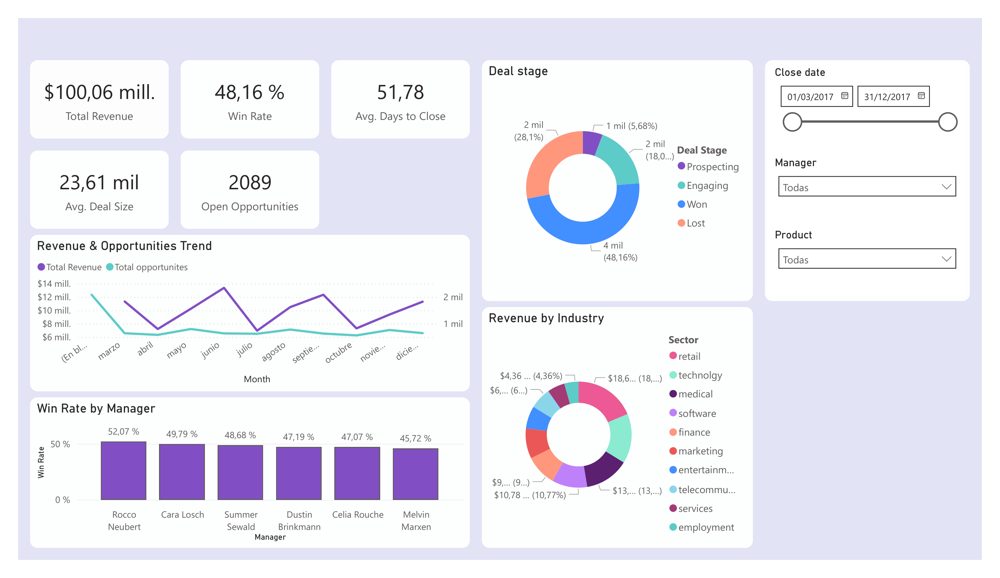

# 📊 B2B Sales Pipeline & CRM Performance Dashboard

An end-to-end Business Intelligence project designed to evaluate sales force effectiveness, monitor pipeline health, and analyze global revenue generation.

## 🎯 Project Overview
The objective of this project was to transform raw CRM data into actionable business insights. By engineering a robust ETL pipeline and designing an interactive Power BI dashboard, this solution enables stakeholders to track conversion rates, identify top-performing managers, and analyze revenue trends by industry.

## 🛠️ Architecture & Tech Stack
This project simulates a complete Data Analytics workflow:
* **Data Extraction & Transformation (Python):** Developed a robust ETL script (`etl_pipeline.py`) utilizing `pandas` and `re` for data cleansing, text sanitization, column normalization, and null-value handling.
* **Data Warehousing (SQLite):** Designed and deployed a relational database optimized with indexing for efficient querying.
* **Data Modeling & Visualization (Power BI):** Constructed a Star Schema data model connecting the fact table (Sales Pipeline) with dimension tables (Accounts, Products, Teams). Implemented advanced DAX measures for dynamic KPIs.

## 💡 Key Business Insights
* **Global Win Rate:** The sales team maintains an overall success rate of **48.16%**.
* **Average Deal Size:** Each closed-won deal brings an average of **$23.61K** in revenue, establishing a clear baseline for future financial projections.
* **Top Performers:** Rocco Neubert leads the management team with a 52.07% conversion rate, slightly outperforming the 47-49% average of the broader team.
* **Sales Cycle:** The team takes an average of **51.78 days** to close a deal, highlighting an opportunity to optimize the negotiation ("Engaging") phase.

## 🚀 Dashboard Features
* **Dynamic KPIs:** Real-time calculation of Total Revenue ($100M+), Win Rate, and Open Opportunities.
* **Interactive Slicers:** Date ranges, Manager selection, and Product filtering for granular analysis.
* **UI/UX Design:** Corporate-level layout with clear visual hierarchy, utilizing donut charts for distribution (Deal Stage & Industry) and dual-axis line charts for trend tracking.

## 📂 Repository Structure
* `/data`: Original raw CSV files (Accounts, Products, Pipeline, Teams).
* `/script`: Python ETL pipeline script.
* `crm_database.db`: The finalized SQLite database.
* `Dashboard_Ventas.pbix`: The interactive Power BI file.
* `Dashboard_Preview.pdf`: A static export of the dashboard for quick viewing.

---
*Note: This is a portfolio project using synthetic CRM data to demonstrate end-to-end data analytics capabilities.*
